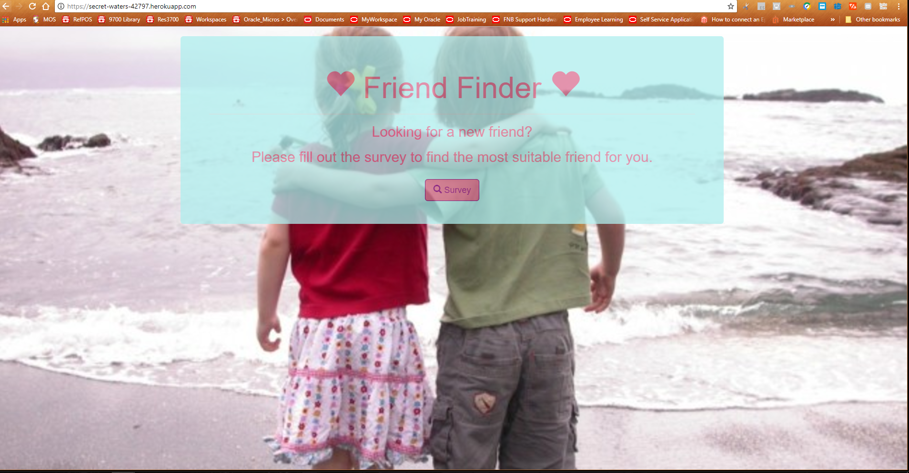

#Friend Finder

A compatibility-based "FriendFinder" application -- basically a dating app. Used Express.js to handle routing. Deployed the app to Heroku.
This full-stack site takes in results of visitors' surveys, then compare their answers with those from other visitors. 
The app will then display the name and picture of the user with the best overall match.

[Please click here to visit the site.](https://secret-waters-42797.herokuapp.com/)

***

